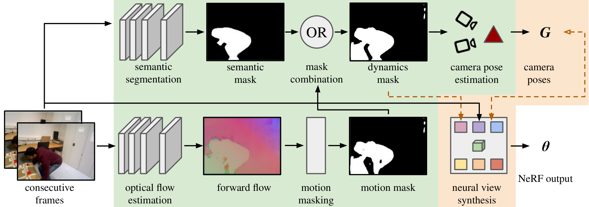

# DynaMoN: Motion-Aware Fast and Robust Camera Localization for Dynamic Neural Radiance Fields

This is the official code for our paper [DynaMoN: Motion-Aware Fast and Robust Camera Localization for Dynamic Neural Radiance Fields](https://ieeexplore.ieee.org/document/10777295).

The accurate reconstruction of dynamic scenes with neural radiance fields is significantly dependent on the estimation of camera poses. Widely used structure-from-motion pipelines encounter difficulties in accurately tracking the camera trajectory when faced with separate dynamics of the scene content and the camera movement. To address this challenge, we propose <u>Dyn</u>amic <u>Mo</u>tion-Aware Fast and Robust Camera Localization for Dynamic <u>N</u>eural Radiance Fields (<b>DynaMoN</b>). DynaMoN utilizes semantic segmentation and generic motion masks to handle dynamic content for initial camera pose estimation and statics-focused ray sampling for fast and accurate novel-view synthesis. Our novel iterative learning scheme switches between training the NeRF and updating the pose parameters for an improved reconstruction and trajectory estimation quality. The proposed pipeline shows significant acceleration of the training process. We extensively evaluate our approach on two real-world dynamic datasets, the TUM RGB-D dataset and the BONN RGB-D Dynamic dataset. DynaMoN improves over the state-of-the-artboth in terms of reconstruction quality and trajectory accuracy.



## Installation
### Clone the repository
```Bash
git clone https://github.com/HannahHaensen/DynaMoN.git
```

### Creating a new anaconda environment and installing pytorch and necessary libraries

Create conda environment:
```Bash
conda create -n dynamon python=3.8
conda activate dynamon
```
Then install pytorch:
```Bash
pip install torch==1.13.1+cu117 torchvision==0.14.1+cu117 --extra-index-url https://download.pytorch.org/whl/cu117
pip install "git+https://github.com/facebookresearch/pytorch3d.git@stable"
```
and afterwards the necessary libraries:
```Bash
pip install -r requirements.txt
```
```Bash
pip install evo --upgrade --no-binary evo
```

### Compile the extensions (can take up to several minutes)
```Bash
conda install cuda-nvcc=11.7 -c nvidia
python setup.py install
```
Download the model from google drive [(droid.pth)](https://drive.google.com/file/d/1evdx9_jdMejsVJ3H9uJW9a2V4LFqbs3L/view?usp=drive_link) and put it into the project root folder.

### Compile DCNv2
```Bash
cd src/DytanVO/Network/rigidmask/networks/DCNv2
python setup.py install
```
Unzip [this folder](https://drive.google.com/file/d/1zNANgZld5WLqCESOJoi8PyRydTQP5gwW/view?usp=sharing) in the project root folder. There should now be a folder "models".

## Evaluation
We provide evaluation scripts for TUM RGB-D and Bonn RGB-D Dynamic datasets.

TUM RGB-D (exemplary for freiburg3_sitting_xyz):
```Bash
python evaluation_scripts/train_tum.py --datapath /path/to/data/rgbd_dataset_freiburg3_sitting_xyz --disable_vis --filter_motion --filter_semantics
```

Bonn RGB-D (exemplary for rgbd_bonn_crowd):
```Bash
python evaluation_scripts/train_bonn.py --datapath /path/to/data/rgbd_bonn_crowd --disable_vis --filter_motion --filter_semantics
```

## Acknowledgement
Our work is based on these different codebases that are thankfully available open-source: [HexPlane](https://github.com/Caoang327/HexPlane), [DROID-SLAM](https://github.com/princeton-vl/DROID-SLAM) and [DytanVO](https://github.com/castacks/DytanVO). We also use the relative rotation accuracy metric calculation from [PoseDiffusion](https://github.com/facebookresearch/PoseDiffusion). Please respect their licenses when using the code.

If you use our code or paper for your work, please consider citing:
```bibtex
@ARTICLE{10777295,
  title={DynaMoN: Motion-Aware Fast and Robust Camera Localization for Dynamic Neural Radiance Fields}, 
  author={Schischka, Nicolas and Schieber, Hannah and Karaoglu, Mert Asim and Gorgulu, Melih and Grötzner, Florian and Ladikos, Alexander and Navab, Nassir and Roth, Daniel and Busam, Benjamin},
  journal={IEEE Robotics and Automation Letters}, 
  year={2024},
  volume={},
  number={},
  pages={1-8},
  keywords={Cameras;Dynamics;Neural radiance field;Location awareness;Simultaneous localization and mapping;Training;Robot vision systems;Accuracy;Semantics;Optimization;Localization;Mapping},
  doi={10.1109/LRA.2024.3511399}}

```

## License
 <p xmlns:cc="http://creativecommons.org/ns#" >This codebase is licensed under <a href="https://creativecommons.org/licenses/by-nc/4.0/?ref=chooser-v1" target="_blank" rel="license noopener noreferrer" style="display:inline-block;">Creative Commons Attribution-NonCommercial 4.0 International</a></p> 